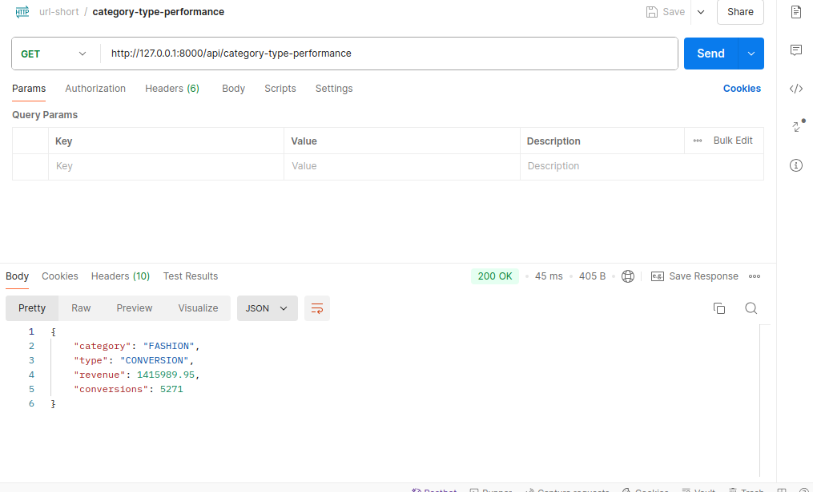
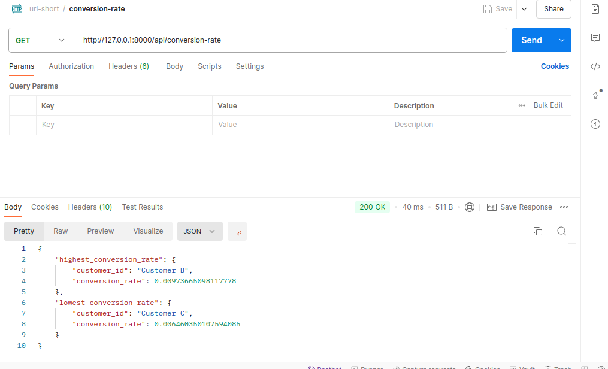
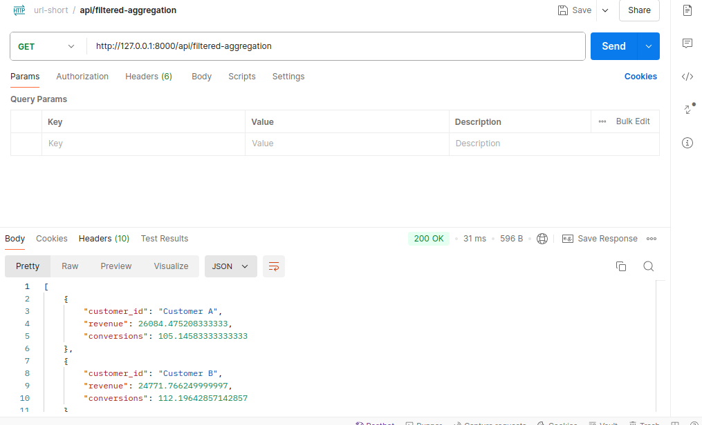
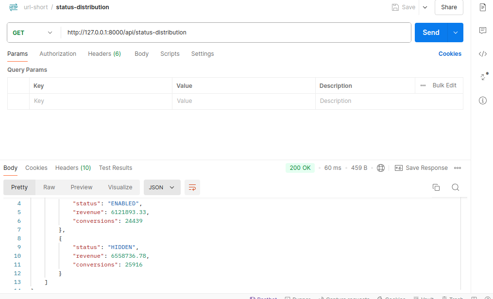

### About application:
This project is a web-based application designed to analyze and visualize data related to conversion rates, revenue, and customer behavior. The application is built using Django, a Python web framework, and utilizes various libraries and tools to provide a comprehensive and user-friendly experience.
### Category Type

### Conversion Rate

### Filtered Aggregation

### Status Distribution

